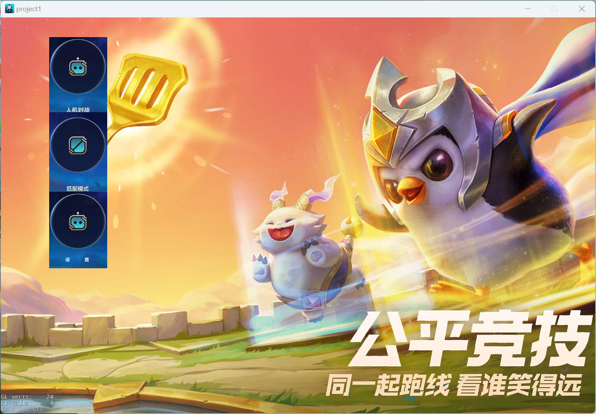
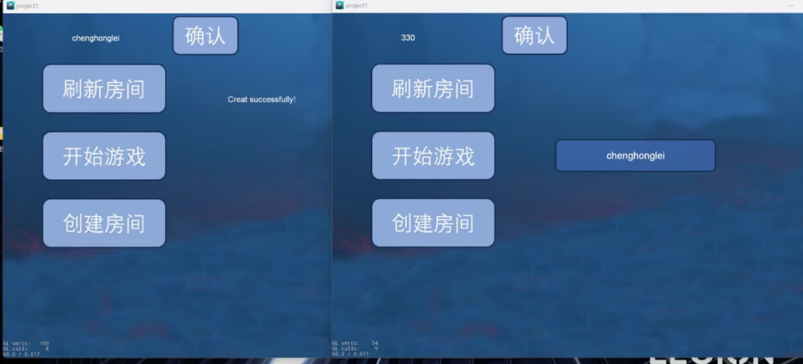

# 金铲铲之战-330版

## 项目介绍

  这是2022级软件学院程序设计范式课程的期末大项目，本项目参考手游版实现了PC端的金铲铲之战。以下是该游戏的介绍（摘自百度百科）：

> 《金铲铲之战》是由腾讯游戏制作发行的一款策略塔防类手游，该作于2021年11月10日正式公开测试。
> 
> 《金铲铲之战》是英雄联盟云顶之弈正版授权的自动战斗品类手游，每局比赛由八名玩家共同进行一场各自为战的博弈对抗，玩家通过招兵买马，融合英雄，提升战力，排兵布阵，成为最终立于战场上的赢家。

## 项目支持功能与简要展示

- 有初始界面和设置界面

- 支持背景音效与战斗中的音效

- 支持多种类型的卡牌

- 支持卡牌升级功能

- 支持小小英雄的移动 场上卡牌支持红蓝血条，蓝条满时可以释放技能。

- 支持创建房间和加入房间的功能 支持练习模式，玩家可以和N个AI玩家对弈，N>=2。

- 支持联机模式，玩家可以和N个人类玩家联机对弈，至少支持2个玩家联机对战。

- 支持装备系统（包括装备的移出，随机等等） 
  
  

**进入游戏界面：**

**AI对战：**

*己方备战环节*  (商城刷新，派兵布局，英雄买卖，装备购买，合成升星)

*对战画面：* 自动追踪与选中目标攻击

**联机对战：** 支持创建房间与加入已有房间，显示房间成员，仅房主可以开始游戏

## 项目技术栈与目录结构

   本项目采用纯**C++** 实现，主要采用了**Cocos2d-x v4.0游戏引擎**。

   Class文件夹下是本项目的核心源代码，Resource文件夹下是本游戏实现的一些资源文件。     原本想将cocos的工程项目目录结构放上去，不过当时的电脑配置环境已经变化，无法再重新运行，配环境又是一件很麻烦的事情，而且好像意义也不大，遂罢。仅上传了这个项目的核心部分，若想要快捷地运行这个项目，还是有些困难，不过代码和资源都可供参考，尤其是资源文件夹中的英雄，这是我的项目队友们一帧一帧手工截图和抠图制作而成，资源的精美与丰富程度我想可称为本届之最。

## 个人工作介绍

**项目分工:**  ***前端开发***

负责**整个游戏界面的可视化与交互操作逻辑实现**，并衔接小组成员的各部分成果。

完成游戏进入界面，主菜单界面，设置界面(含功能实现)，联机界面，游戏备战阶段界面。
**本部分工作亮点:**
1.棋盘可视化界面精美，各部分显示比例协调
2.实时高亮显示当前拖动选中位置
3.当拖动处于非法位置时自动返回原位置
4.支持相同棋子的升星合成
5.支持装备系统

## 个人感受

  其实一直有计划对这个项目进行一个整理和梳理，许多许多原因，让我今天才得以更新。时隔将近一年，其实很多感受已不同于当下，但我觉得仍然有意义去思考和记录。

  这是我进入软件工程专业后的第一个团队合作项目。实话实说，无论是当时来看还是现在来看，这个项目从代码的质量角度，从功能实现程度与思路，并不完美；但通过这个项目学到的却远远不止这些，我到现在都深刻地觉得这个项目是我代码生涯的启航和启蒙之作，它让我学会了作为一名软件开发人员的一些基础素养：如何去分析一个项目实现的逻辑，如何调用别人的接口（包括什么是接口，其实最初的印象也是从这里学得，现在对它的理解当然又有不同），如何去自学并使用一个框架（这里是引擎），如何去和其他人合作和沟通，如何利用工具去调试和debug，包括什么是前端（其实当初连前端这个概念都没有，就是一个软件实现的逻辑划分当时也不懂，在我看来，所有的一切代码实现就是混作一团），如何实现交互，如何去模块化和定义类，什么是Git等等这样再基础不过的东西，当然还有一些关乎内存泄漏以及C++语言的很多知识，都在本次项目中得到实践和认知。

  我爱这样一个不完美的项目，它并不“软件”，但是让我爱上了软件工程。
